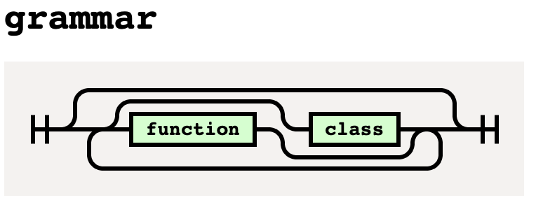
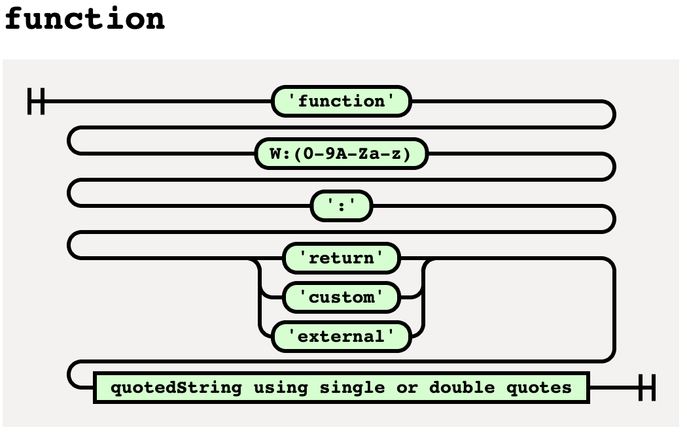
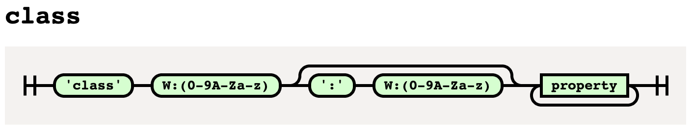
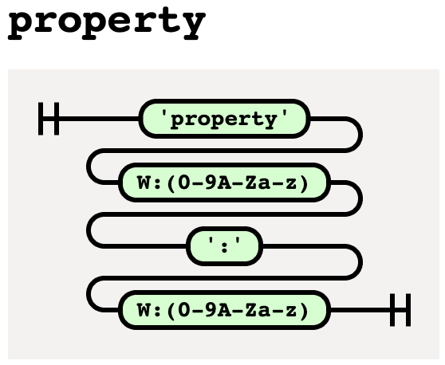

# Configuration Parsing Method Evaluation

When it comes to parsing text files containing configuration values, many methods unfold. This Jupyter Notebook and the 
supporting files aim to compare multiple different methods and comparing their execution times. Additionally, the 
readability of the resulting configuration files should be inspected. 

The following methods where chosen:
- YAML config
- XML config
- Libg3n DSL config with _pyparsing_
- Libg3n DSL config with a manual implemented parser

## Motivation

This notebook was developed in the course of the master thesis _**"Evaluierung von Methoden der Generativen Programmierung
zur automatischen Konfiguration von Programmbibliotheken"**_ by _Jan Kloß_.

**Abstract**

The development of complex software systems is increasingly based on the use of program libraries to map specific
functions. They are designed to be as universally applicable as possible, which makes it necessary to adapt them to the
specific software project in some cases. In order to reduce the required customization effort, methods and concepts of
Generative Programming were investigated and their suitability for an automatic configuration of program libraries was
evaluated. In this context, the conception and implementation of a library was pursued to realize such an automatic
configuration. Within the framework of a web application it should be tested whether the identified suitable methods
contribute to a reduction in the configuration effort of program libraries. In the course of this work the program
library Libg3n was developed. Libg3n allows a universal configuration of arbitrary libraries and the automatic
generation of program code based on a Domain-Specific Language respectively a code generator. Compatibility with
different programming languages was established by the extension of Libg3n in the form of Language Modules. In addition,
the usability of Libg3n was confirmed during the implementation of a graphical interface. As a result, the effort
required to adapt program libraries has been significantly reduced. Further steps to customize Libg3n have also been
identified, which must be performed before the library can be used productively.

## Libg3n

Libg3n is a python module designed for the automatic configuration and generation of program libraries. The module
systematically searches for variation points which are specified in the program library source files. The sourcecode for
Libg3n can be found in the [libg3n](https://www.github.com/jhkloss/libg3n) repository.

## Libg3n DSL

The **_Libg3n_**  Domain-Specific Language was developed to describe variation points for the automatic generation of 
program libraries. The language specification can be observed in the following railroad diagrams:

## License

MIT License

Copyright (c) 2022 Jan Kloß

Permission is hereby granted, free of charge, to any person obtaining a copy
of this software and associated documentation files (the "Software"), to deal
in the Software without restriction, including without limitation the rights
to use, copy, modify, merge, publish, distribute, sublicense, and/or sell
copies of the Software, and to permit persons to whom the Software is
furnished to do so, subject to the following conditions:

The above copyright notice and this permission notice shall be included in all
copies or substantial portions of the Software.

THE SOFTWARE IS PROVIDED "AS IS", WITHOUT WARRANTY OF ANY KIND, EXPRESS OR
IMPLIED, INCLUDING BUT NOT LIMITED TO THE WARRANTIES OF MERCHANTABILITY,
FITNESS FOR A PARTICULAR PURPOSE AND NONINFRINGEMENT. IN NO EVENT SHALL THE
AUTHORS OR COPYRIGHT HOLDERS BE LIABLE FOR ANY CLAIM, DAMAGES OR OTHER
LIABILITY, WHETHER IN AN ACTION OF CONTRACT, TORT OR OTHERWISE, ARISING FROM,
OUT OF OR IN CONNECTION WITH THE SOFTWARE OR THE USE OR OTHER DEALINGS IN THE
SOFTWARE.